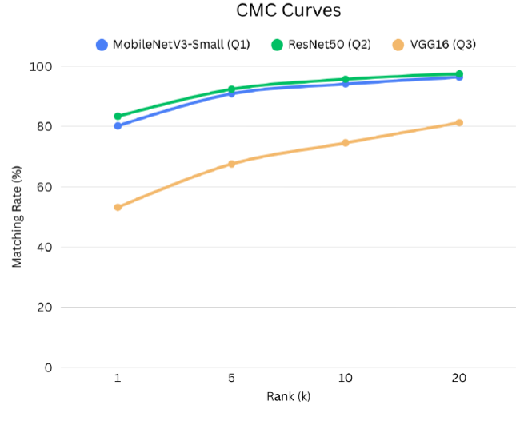
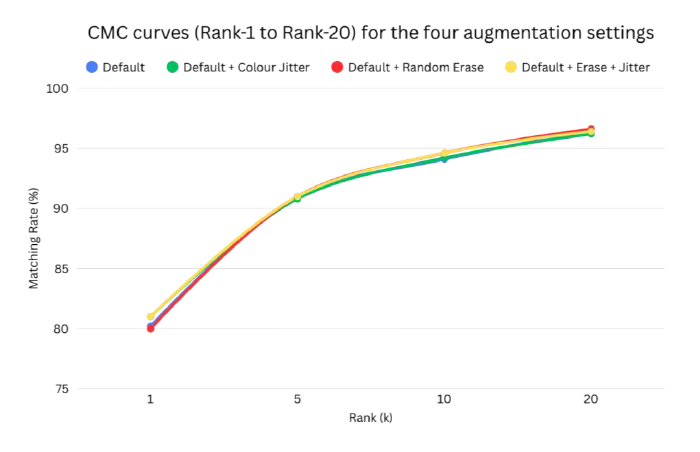
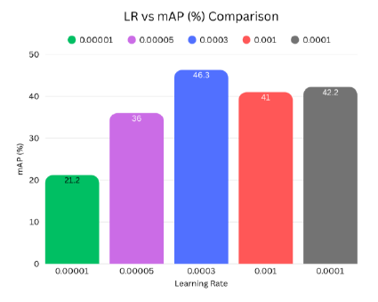
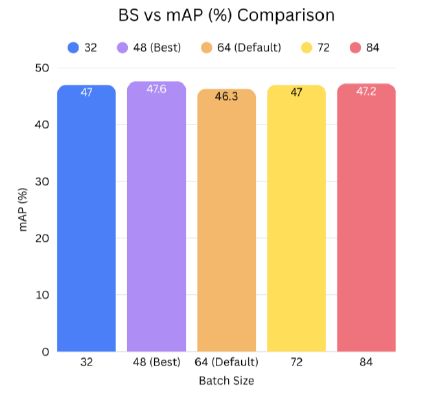
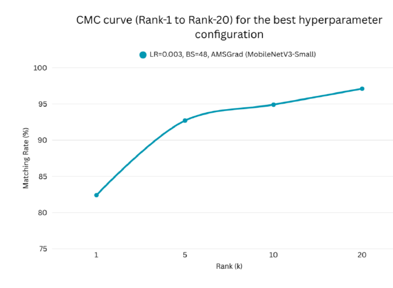

# Vehicle Re-Identification with Deep Learning

**Systematic hyperparameter tuning and architecture benchmarking for vehicle re-identification — evaluated on the VeRi-776 dataset.**

This project was completed as part of an MSc Artificial Intelligence programme at the University of Surrey (Module: Advanced Topics in Computer Vision and Deep Learning).

> **Note:** The training codebase was provided by the University of Surrey and is subject to copyright — it is not included in this repository. This repository documents the experimental methodology, hyperparameter configurations, and results.

---

## Task Overview

The goal was to re-identify vehicles across multiple cameras using deep learning models trained with a combined cross-entropy and hard triplet loss. The assignment was structured as a sequential hyperparameter tuning exercise across four sections.

**Dataset:** VeRi-776 — 576 vehicle identities, 37,778 training images, 1,678 query images, 11,579 gallery images captured across 20 cameras. Performance is measured using mean Average Precision (mAP) and Cumulative Matching Characteristics (CMC) Rank-1/5.

**Loss functions:** Cross-entropy loss + hard triplet loss (AMSGrad optimiser, unless otherwise noted).

---

## Section 1 — Architecture Comparison

Three architectures were trained with identical default hyperparameters (AMSGrad, lr=3×10⁻⁴, batch size=64, 10 epochs) and evaluated on the test set.

| Experiment | Model | mAP (%) | Rank-1 (%) | Rank-5 (%) | Params (M) | Feature Dim | Training Time |
|---|---|---|---|---|---|---|---|
| Q1 (default) | MobileNetV3-Small | 44.5 | 80.2 | 90.9 | 0.93 | 576 | 34 min |
| **Q2** | **ResNet50** | **51.1** | **83.4** | **92.4** | 23.5 | 2048 | 2 h 9 min |
| Q3 | VGG16 | 18.2 | 53.2 | 67.6 | 14.7 | 25088 | 2 h 56 min |



**Key finding:** ResNet50 outperformed MobileNetV3-Small by +6.6% mAP (+15%). Its residual connections improve gradient flow and its 2048-dimensional feature map captures richer vehicle details. VGG16 performed worst despite its large feature vector — the 25,088-dimensional representation likely caused overfitting, and the absence of skip connections hinders gradient flow. The lightweight MobileNetV3-Small offered a strong accuracy/speed trade-off at 34-minute training.

---

## Section 2 — Data Augmentation Experiments

Starting from the default augmentation (random horizontal flip + Random2DTranslation), additional techniques were appended one at a time, then combined.

| Configuration | mAP (%) | Rank-1 (%) | Rank-5 (%) |
|---|---|---|---|
| Default | 44.5 | 80.2 | 90.9 |
| Default + Colour Jitter | 44.6 | 81.0 | 90.8 |
| Default + Random Erase | 46.3 | 80.0 | 90.7 |
| **Default + Random Erase + Colour Jitter (best)** | **46.6** | **81.0** | **91.0** |

*(MobileNetV3-Small, AMSGrad, lr=3×10⁻⁴, batch size=64, 10 epochs)*



**Key finding:** Colour jitter alone produced a negligible gain (+0.1% mAP), indicating that moderate colour variation does not provide meaningful additional signal. Random erasing delivered a clear +1.8% improvement by masking regions of the vehicle, forcing the model to focus on other discriminative parts. Combining both techniques yielded the highest mAP of 46.6%, as colour diversity strengthens the features learned over the unmasked patches.

---

## Section 3 — Hyperparameter Exploration

### 3.1 Learning Rate

Five learning rates were evaluated. All other settings were held at default.

| Learning Rate | mAP (%) | Rank-1 (%) |
|---|---|---|
| 1×10⁻⁵ | 21.2 | 46.5 |
| 5×10⁻⁵ | 36.0 | 64.9 |
| 1×10⁻⁴ | 42.2 | 75.3 |
| **3×10⁻⁴ (default — best)** | **46.3** | **80.0** |
| 1×10⁻³ | 41.0 | 79.0 |

*(MobileNetV3-Small, AMSGrad, batch size=64, 10 epochs)*



**Key finding:** lr=3×10⁻⁴ was optimal. Very low learning rates (≤5×10⁻⁵) failed to converge within 10 epochs. A high learning rate (1×10⁻³) converged quickly but overshot stable minima, generalising poorly. The default rate provided the best balance between convergence speed and stability.

### 3.2 Batch Size

Using the best learning rate (lr=3×10⁻⁴) and best augmentation, five batch sizes were evaluated.

| Batch Size | mAP (%) | Rank-1 (%) |
|---|---|---|
| 32 | 47.0 | 82.7 |
| **48 (best)** | **47.6** | **82.4** |
| 64 (default) | 46.3 | 80.0 |
| 72 | 47.0 | 81.8 |
| 84 | 47.2 | 80.8 |

*(MobileNetV3-Small, AMSGrad, lr=3×10⁻⁴, 10 epochs)*



**Key finding:** Batch size 48 achieved the highest mAP of 47.6%. Smaller batches introduce gradient noise that acts as an implicit regulariser, improving generalisation. Very small batches (32) and very large batches (≥64) both performed slightly worse — the former can be unstable, while the latter reduces gradient noise and sharpens minima.

### 3.3 Optimiser

Fixing the best learning rate (lr=3×10⁻⁴) and batch size (48), SGD was compared against the default AMSGrad.

| Optimiser | mAP (%) | Rank-1 (%) |
|---|---|---|
| **AMSGrad (default)** | **47.6** | **82.4** |
| SGD | 19.9 | 44.4 |

*(MobileNetV3-Small, lr=3×10⁻⁴, batch size=48, 10 epochs)*



**Key finding:** Switching to SGD caused a severe drop to 19.9% mAP. Without adaptive moment estimates, SGD with momentum failed to navigate the loss landscape effectively within 10 epochs. AMSGrad's per-parameter adaptive learning rates are clearly better suited to this task.

---

## Summary of Findings

| Section | Factor | Best Configuration | mAP (%) | Rank-1 (%) |
|---|---|---|---|---|
| 1 | Architecture | ResNet50 | **51.1** | 83.4 |
| 2 | Data Augmentation | Default + Random Erase + Colour Jitter | 46.6 | 81.0 |
| 3.1 | Learning Rate | 3×10⁻⁴ | 46.3 | 80.0 |
| 3.2 | Batch Size | 48 | 47.6 | 82.4 |
| 3.3 | Optimiser | AMSGrad | 47.6 | 82.4 |

The best single result across all experiments was **ResNet50 with default hyperparameters (mAP = 51.1%)**. For MobileNetV3-Small, combining optimal augmentation, learning rate, and batch size progressively raised mAP from 44.5% to 47.6%.

---

## Experiment Configuration

All experiments were run using the university-provided training script (`main.py`). The baseline configuration is shown below; individual arguments were modified for each subsequent experiment as described above.

```bash
python main.py \
  -s veri \
  -t veri \
  -a mobilenet_v3_small \
  --root path/to/VeRi \
  --height 224 \
  --width 224 \
  --optim amsgrad \
  --lr 0.0003 \
  --max-epoch 10 \
  --stepsize 20 40 \
  --train-batch-size 64 \
  --test-batch-size 100 \
  --save-dir logs/mobilenet_v3_small-veri
```

See [`train.sh`](train.sh) for all experiment configurations with results annotated as comments.

---

## Tools & Environment

| Tool | Purpose |
|---|---|
| Python / PyTorch | Model training and evaluation |
| MobileNetV3-Small | Default lightweight CNN backbone |
| ResNet50 | Best-performing architecture (residual CNN) |
| VGG16 | Plain CNN comparison |
| VeRi-776 | Vehicle re-identification dataset (20 cameras, 576 IDs) |
| Google Colab / University HPC | Training compute platform (GPU) |

---

## References

- He, K., et al. (2016). Deep residual learning for image recognition. *CVPR 2016*.
- Howard, A., et al. (2019). Searching for MobileNetV3. *ICCV 2019*.
- Keskar, N. S., et al. (2017). On large-batch training for deep learning: Generalisation gap and sharp minima. *ICLR 2017*.
- Kingma, D. P., & Ba, J. (2015). Adam: A method for stochastic optimisation. *ICLR 2015*.
- Liu, X., et al. (2016). Large-scale vehicle re-identification in urban surveillance videos. *ICME 2016*.
- Schroff, F., et al. (2015). FaceNet: A unified embedding for face recognition and clustering. *CVPR 2015*.
- Simonyan, K., & Zisserman, A. (2015). Very deep convolutional networks for large-scale image recognition. *ICLR 2015*.

---

*MSc Artificial Intelligence, University of Surrey*
